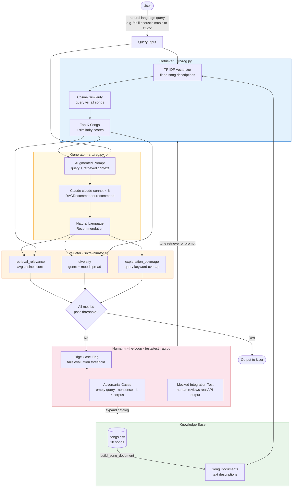

# VibeMatcher RAG System Diagram

## Overview

The RAG (Retrieval-Augmented Generation) layer sits alongside the existing
weighted-scoring recommender. It accepts **natural language queries** instead
of structured `UserProfile` objects, retrieves the most relevant songs from
the catalog, then passes them as grounded context to Claude to generate rich,
conversational explanations.

---

## Component Diagram (Mermaid)



---

## Data Flow (text summary)

```
INPUT
  User types: "I want something energetic and happy for working out"
       │
       ▼
KNOWLEDGE BASE
  songs.csv ──► build_song_document() ──► 18 SongDocument text chunks
  (loaded once at startup; re-used across queries)
       │
       ▼
RETRIEVER  (src/rag.py · Retriever)
  TF-IDF vectorizer encodes all 18 song descriptions + the user query
  Cosine similarity ranks every song against the query
  Top-K (default 3) songs + their scores are returned
       │
       ▼
GENERATOR  (src/rag.py · RAGRecommender → Claude claude-sonnet-4-6)
  Augmented prompt = user query  +  retrieved song metadata (as context)
  Claude generates natural-language recommendations with musical reasoning
  Output: a paragraph explaining why each song fits the request
       │
       ▼
EVALUATOR  (src/evaluator.py · evaluate())
  retrieval_relevance  — are the retrieved songs actually similar to the query?
  diversity            — do results span different genres and moods?
  explanation_coverage — does the explanation address the user's keywords?
       │
       ├─► All pass ──► Output delivered to user
       │
       └─► Any fail ──► HUMAN REVIEW (see below)

OUTPUT
  Recommended song titles + Claude-written explanations
```

---

## Human / Testing Involvement

| Where | Who | What they check |
|---|---|---|
| `tests/test_rag.py` — adversarial cases | Developer / CI | Empty queries, nonsense input, k > corpus — system must not crash |
| `tests/test_rag.py` — mocked integration | Developer | Full pipeline structure; real Claude output inspected manually before shipping |
| Evaluator threshold check | Automated + human | If any metric (relevance, diversity, coverage) falls below an acceptable level, the result is flagged for human review |
| `model_card.md` reflection | Human author | Bias audit: does the retriever over-retrieve the same genre? Does Claude hallucinate song details? |

---

## Component Responsibilities

| Component | File | Input | Output |
|---|---|---|---|
| Song Documents | `src/rag.py` | `songs.csv` dicts | Text descriptions for TF-IDF |
| Retriever | `src/rag.py` | Natural language query | Top-K songs + similarity scores |
| Generator | `src/rag.py` | Query + retrieved context | Natural language recommendation |
| Evaluator | `src/evaluator.py` | RAG result dict | `{relevance, diversity, coverage}` scores |
| Tester | `tests/test_rag.py` | Retriever + Evaluator + mock LLM | Pass/fail assertions + human flag comments |
| Knowledge Base | `data/songs.csv` | — | Song metadata (genre, mood, energy, …) |
